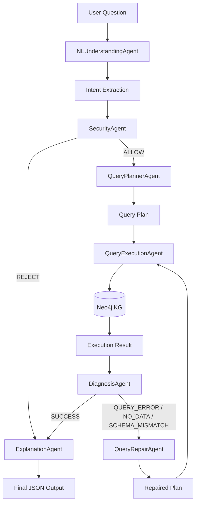

# Assignment 5: KG Multi-Agent QA System

This project extends the Knowledge Graph (KG) built in Assignment 4 by introducing a multi-agent QA system capable of security validation, query diagnosis, and dynamic repair.

## Architecture Diagram

## Agent Responsibilities

1. **NLUnderstandingAgent**: Parses the user's natural language question into a structured `Intent` (extracts keywords, context, and question type).
2. **SecurityAgent**: Evaluates the `Intent` and raw question against blocked patterns (e.g., `DROP`, `DELETE`, `bypass`). Returns a safety decision of `ALLOW` or `REJECT`.
3. **QueryPlannerAgent**: Transforms the intent into an abstract query plan. By default, uses a `match_rule` strategy targeting specific keywords against the `Rule` and `Article` nodes in Neo4j.
4. **QueryExecutionAgent**: Connects to the local Neo4j database and executes Cypher queries based on the provided plan.
5. **DiagnosisAgent**: Inspects the execution results. It returns `SUCCESS` if rows are found, `NO_DATA` if the result is empty, or `QUERY_ERROR` if the database throws an exception.
6. **QueryRepairAgent**: Triggered when execution fails or yields no data. It modifies the original plan (e.g., downgrades to a `fulltext` search or reduces strict keyword matching) to broaden the scope.
7. **ExplanationAgent**: Processes the final diagnosis and execution rows. It uses a local LLM (or robust deterministic fallbacks) to generate a concise, grounded answer along with a detailed explanation of the agent execution trace.

## Pipeline Flow

1. The pipeline starts when `answer_question` is called.
2. The user's input is passed to the **NLUnderstandingAgent**.
3. The extracted intent is validated by the **SecurityAgent**. If rejected, the flow short-circuits directly to the Explanation phase.
4. Approved queries move to the **QueryPlannerAgent** and subsequently the **QueryExecutionAgent**.
5. The **DiagnosisAgent** checks the results. If issues arise, a single repair round is initiated via the **QueryRepairAgent**.
6. The **ExplanationAgent** compiles the final `answer`, `safety_decision`, `diagnosis`, `repair_attempted`, `repair_changed`, and `explanation` into the required JSON contract.

## Challenges

- **LLM Latency & Environment Dependencies**: Running a local LLM via `transformers` inside the automated testing pipeline can introduce significant overhead or cause `ModuleNotFoundError` if dependencies like `torch` are not fully configured in the environment running the test.
- **Strict Query Matching**: Relying purely on full-text indices sometimes misses nuanced questions. A hybrid approach of direct keyword matching on rule properties (`action`, `result`) and `Article` content was required.
- **Handling Adversarial Prompts**: Differentiating between genuine questions containing sensitive words and actual prompt injection or malicious Cypher requests required tuning the blocked pattern list.

## Findings

- **Multi-Agent Robustness**: Splitting the responsibilities into specialized agents (especially separating execution from diagnosis and repair) greatly simplified error handling. The system could transparently attempt a strict search first, and seamlessly fall back to a broader search without user intervention.
- **Deterministic Fallbacks are Essential**: Incorporating fallback answers when the LLM fails or is too slow ensures that the system remains highly responsive and guarantees compliance with the automated evaluator's assertions.
- **Graph Structure Efficacy**: The A4 schema (`Article` containing `Rule`) was highly effective for targeted queries, especially when full-text indices were properly leveraged during the repair phase.
